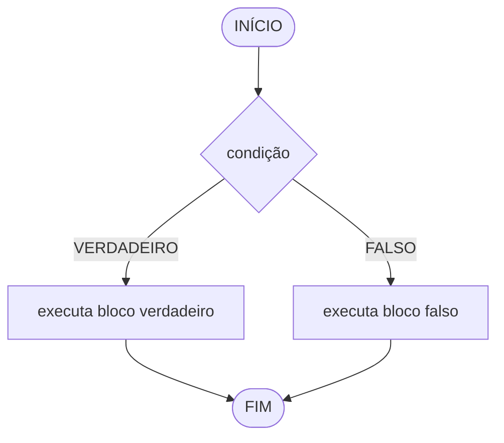
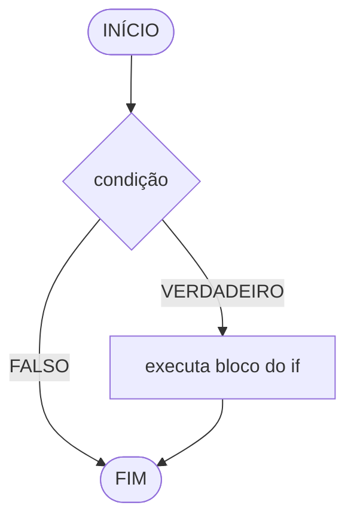
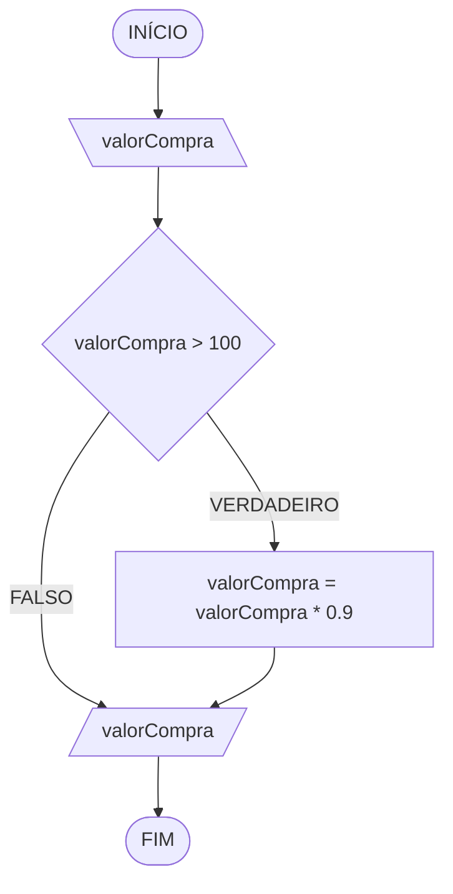
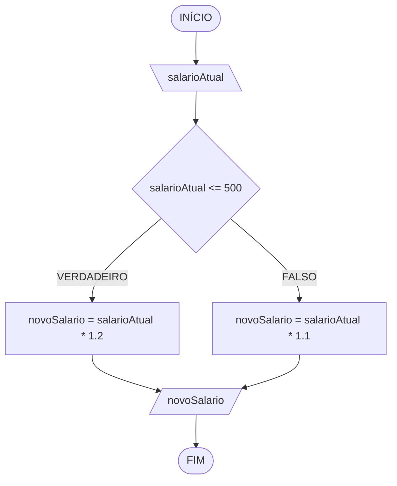
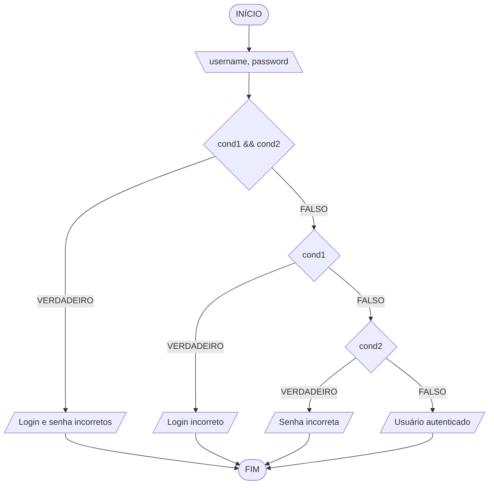

### 1. Controle de fluxo
Em algoritmos, o fluxo de execução pode seguir três formas principais:
- **sequencial**: executa instruções em ordem, sem desvios;
- **condicional**: escolhe caminhos diferentes conforme uma condição;
- **repetição**: repete um bloco de instruções enquanto uma condição for atendida.



### 2. Condição lógica
Uma condição é uma expressão que resulta em:
- valor diferente de `0` (verdadeiro), ou
- `0` (falso).

Em C e C++, não existe um tipo booleano nativo em C puro (a menos que se inclua `<stdbool.h>`), então qualquer expressão numérica é tratada como falsa se for `0` e verdadeira caso contrário. Em C++, o tipo `bool` já é nativo, com os valores `true` e `false`.

Exemplos:
- `idade >= 18`
- `nota >= 6`
- `(media >= 5) && (frequencia >= 75)`

### 3. Estrutura condicional simples (`if`)
Usada quando existe ação apenas para o caso verdadeiro.

Sintaxe:
```c
if (condicao) {
    // executa se condicao for verdadeira (diferente de 0)
}
```

Fluxograma (Mermaid):


Exemplo prático 1 — versão em C:
```c
#include <stdio.h>

int main(void) {
    // Entrada
    float valorCompra;
    printf("Digite o valor da compra: ");
    scanf("%f", &valorCompra);

    // Regra: aplica desconto apenas acima de 100
    if (valorCompra > 100) {
        valorCompra = valorCompra * 0.9; // desconto de 10%
    }

    // Saída final
    printf("Valor final: %.2f\n", valorCompra);

    return 0;
}
```

Exemplo prático 1 — versão em C++:
```cpp
#include <iostream>

int main() {
    // Entrada
    float valorCompra;
    std::cout << "Digite o valor da compra: ";
    std::cin >> valorCompra;

    // Regra: aplica desconto apenas acima de 100
    if (valorCompra > 100) {
        valorCompra = valorCompra * 0.9; // desconto de 10%
    }

    // Saída final
    std::cout << "Valor final: " << valorCompra << std::endl;

    return 0;
}
```

Fluxograma (Mermaid):


Teste de mesa:

| valorCompra | valorCompra > 100 | saída |
| ---         | ---                | ---   |
| 150         | V                  | 135   |
| 100         | F                  | 100   |
| -80         | F                  | -80   |

> **Observação:** o algoritmo não valida valores negativos — `-80` passa direto sem desconto, mas continua sendo um valor de compra sem sentido no mundo real. Vale como gancho para a próxima aula, sobre validação de entrada.

### 4. Estrutura condicional composta (`if...else`)
Usada quando há ação para o caso verdadeiro e para o caso falso.

Sintaxe:
```c
if (condicao) {
    // bloco verdadeiro
} else {
    // bloco falso
}
```

Fluxograma (Mermaid):


Exemplo prático 2 — versão em C:
```c
#include <stdio.h>

int main(void) {
    // Entrada
    float salarioAtual;
    printf("Digite o salário atual: ");
    scanf("%f", &salarioAtual);

    float novoSalario;

    // Regra de negócio por faixa salarial
    if (salarioAtual <= 500) {
        novoSalario = salarioAtual * 1.2;
    } else {
        novoSalario = salarioAtual * 1.1;
    }

    // Saída formatada com 2 casas decimais
    printf("Novo salário: R$ %.2f\n", novoSalario);

    return 0;
}
```

Exemplo prático 2 — versão em C++:
```cpp
#include <iostream>
#include <iomanip>

int main() {
    // Entrada
    float salarioAtual;
    std::cout << "Digite o salário atual: ";
    std::cin >> salarioAtual;

    float novoSalario;

    // Regra de negócio por faixa salarial
    if (salarioAtual <= 500) {
        novoSalario = salarioAtual * 1.2;
    } else {
        novoSalario = salarioAtual * 1.1;
    }

    // Saída formatada com 2 casas decimais
    std::cout << "Novo salário: R$ " << std::fixed << std::setprecision(2)
               << novoSalario << std::endl;

    return 0;
}
```

Fluxograma (Mermaid):


Teste de mesa:

| salarioAtual | salarioAtual <= 500 | saída |
| ---          | ---                  | ---   |
| 450          | V                    | 540   |
| 500          | V                    | 600   |
| 800          | F                    | 880   |

### 5. Estrutura condicional encadeada (`if...else if...else`)
Usada quando existem mais de duas possibilidades de decisão.

Sintaxe:
```c
if (condicao1) {
    // bloco 1
} else if (condicao2) {
    // bloco 2
} else {
    // bloco final (caso nenhuma condicao anterior seja verdadeira)
}
```

Exemplo prático: autenticação de usuário — versão em C:
```c
#include <stdio.h>
#include <string.h>

int main(void) {
    // Entrada de credenciais
    char username[50];
    int password;

    printf("Digite o usuário: ");
    scanf("%49s", username);

    printf("Digite a senha numérica: ");
    scanf("%d", &password);

    // Regras de autenticação
    // strcmp retorna 0 quando as strings são iguais, por isso comparamos com != 0
    if (strcmp(username, "usuario123") != 0 && password != 123456) {
        printf("Login e senha incorretos\n");
    } else if (strcmp(username, "usuario123") != 0) {
        printf("Login incorreto\n");
    } else if (password != 123456) {
        printf("Senha incorreta\n");
    } else {
        printf("Usuário autenticado\n");
    }

    return 0;
}
```

Exemplo prático: autenticação de usuário — versão em C++:
```cpp
#include <iostream>
#include <string>

int main() {
    // Entrada de credenciais
    std::string username;
    int password;

    std::cout << "Digite o usuário: ";
    std::cin >> username;

    std::cout << "Digite a senha numérica: ";
    std::cin >> password;

    // Regras de autenticação
    if (username != "usuario123" && password != 123456) {
        std::cout << "Login e senha incorretos" << std::endl;
    } else if (username != "usuario123") {
        std::cout << "Login incorreto" << std::endl;
    } else if (password != 123456) {
        std::cout << "Senha incorreta" << std::endl;
    } else {
        std::cout << "Usuário autenticado" << std::endl;
    }

    return 0;
}
```

> Em C, strings não podem ser comparadas com `!=` diretamente — isso compararia endereços de memória, não o conteúdo. Por isso usamos `strcmp`, que retorna `0` quando as strings são iguais (daí a comparação `!= 0` para "diferente"). Em C++, o tipo `std::string` sobrecarrega o operador `!=`, permitindo a comparação direta, assim como fazíamos com `!==` em JavaScript.

Fluxograma (Mermaid):

`cond1 = username diferente de "usuario123"`
`cond2 = password diferente de 123456`



Teste de mesa:

| username   | password | cond1 && cond2 | cond1 | cond2 | saída |
| ---        | ---      | ---             | ---   | ---   | ---   |
| usuario123 | 123456   | F               | F     | F     | Usuário autenticado |
| usuario123 | 999999   | F               | F     | V     | Senha incorreta |
| admin      | 123456   | F               | V     | F     | Login incorreto |
| admin      | 999999   | V               | V     | V     | Login e senha incorretos |

### 6. Operador ternário
Forma resumida para decisões simples em uma linha. A sintaxe é idêntica em C, C++ e JavaScript.

Sintaxe:
```c
condicao ? valorSeVerdadeiro : valorSeFalso;
```

Exemplo prático 3 — versão em C:
```c
#include <stdio.h>

int main(void) {
    // Entrada
    int numero;
    printf("Digite um número inteiro: ");
    scanf("%d", &numero);

    // Regra: resto 0 na divisão por 2 indica número par
    const char *resultado = (numero % 2 == 0) ? "Par" : "Ímpar";

    // Saída
    printf("O número é %s\n", resultado);

    return 0;
}
```

Exemplo prático 3 — versão em C++:
```cpp
#include <iostream>
#include <string>

int main() {
    // Entrada
    int numero;
    std::cout << "Digite um número inteiro: ";
    std::cin >> numero;

    // Regra: resto 0 na divisão por 2 indica número par
    std::string resultado = (numero % 2 == 0) ? "Par" : "Ímpar";

    // Saída
    std::cout << "O número é " << resultado << std::endl;

    return 0;
}
```

### 7. Fechamento
Nesta aula, vimos como:
1. usar condições lógicas para controlar o fluxo de execução;
2. aplicar `if` em decisões simples;
3. aplicar `if...else` quando há dois caminhos possíveis;
4. aplicar `if...else if...else` em regras com várias faixas;
5. organizar condições com `cond1`, `cond2` (e outras) para facilitar fluxograma e teste de mesa;
6. resolver casos práticos de autenticação e classificação por intervalo de valores, observando as diferenças entre comparação de strings em C (`strcmp`) e C++ (`std::string` com `!=`);
7. usar operador ternário em situações curtas e objetivas.

Esses conceitos formam a base para modelar regras de negócio em algoritmos e implementar validações com clareza antes de programar — agora nas duas linguagens de sistema mais usadas, C e C++.

### Saiba mais
- cppreference - `printf`: https://en.cppreference.com/w/c/io/fprintf
- cppreference - `scanf`: https://en.cppreference.com/w/c/io/fscanf
- cppreference - `strcmp`: https://en.cppreference.com/w/c/string/byte/strcmp
- cppreference - `std::cin` / `std::cout`: https://en.cppreference.com/w/cpp/io
- cppreference - `std::string`: https://en.cppreference.com/w/cpp/string/basic_string
- cppreference - Operador condicional (ternário): https://en.cppreference.com/w/cpp/language/operator_other
- cppreference - Instrução `if`: https://en.cppreference.com/w/cpp/language/if
